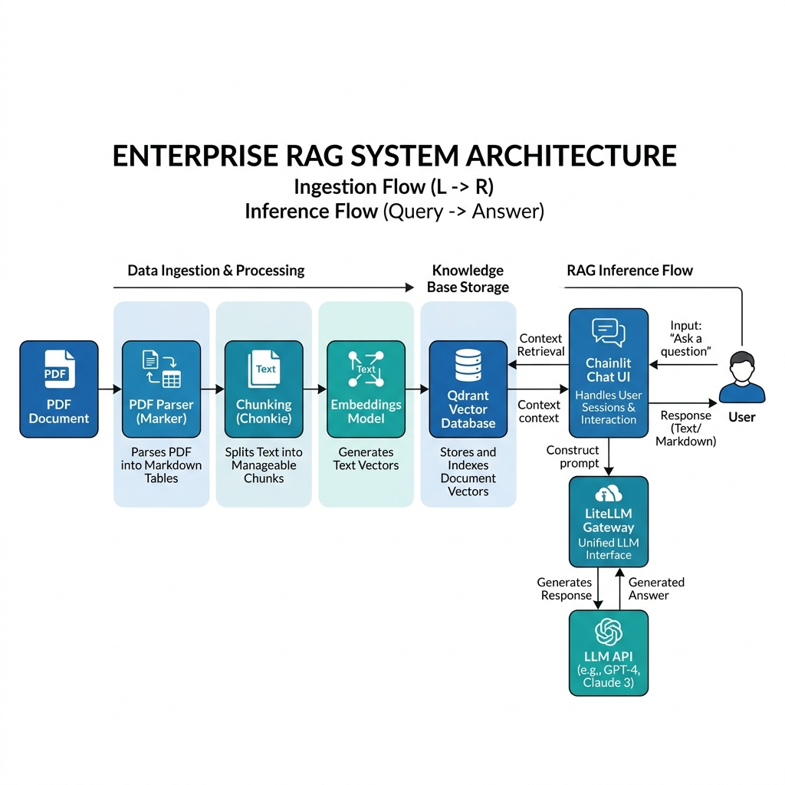

# Exercise 1: Building Enterprise Retrieval-Augmented Generation (RAG)

## 🏆 Project Objective
Build and deploy a production-ready, high-performance Retrieval-Augmented Generation (RAG) application using modern open-source Python tools and a vector database. The application should ingest unstructured PDF documents (containing text and tables), chunk and embed the content, index it into a vector store, and expose it via a clean, conversational streaming Chat UI.

---

## 🛠️ System Architecture

The following diagram outlines the data flows and system layers you will construct:



---

## ⚙️ Detailed Implementation Steps

### 1. Data Processing Stack (Ingestion Pipeline)
Your python pipeline must handle raw PDF documents, extract text and tabular structures, and chunk them semantically.

*   **Extraction with [Marker](https://github.com/AdeelH/maker)**: Write a script `ingest_pdf.py` that takes a PDF, converts it to clean markdown, and ensures tables are output in standard markdown table format.
*   **Chunking with [Chonkie](https://github.com/bhavinjawade/chonkie)**: Import Chonkie to segment your markdown content. Use Chonkie’s semantic or token-based chunkers (e.g., `SDChunker` or `TokenChunker`) to create chunks of ~500 tokens with a 10% overlap, ensuring header contexts and tables are not abruptly cut off.

### 2. Vector Database Setup & Indexing
Deploy a local vector store to index the generated chunks along with metadata.

*   **Qdrant Container Setup**: Define a service in `docker-compose.yml`:
    ```yaml
    version: '3.8'
    services:
      qdrant:
        image: qdrant/qdrant:latest
        container_name: qdrant_db
        ports:
          - "6333:6333"
          - "6334:6334"
        volumes:
          - ./qdrant_storage:/qdrant/storage
    ```
*   **Embedding & Indexing Script**:
    *   Create a Qdrant collection named `enterprise_docs` with the correct vector dimensions (e.g., `384` for `all-MiniLM-L6-v2` or `1536` for OpenAI's `text-embedding-3-small`).
    *   Write a Python script `index_vectors.py` to embed the text chunks and upsert them to Qdrant.
    *   **Payload Metadata**: Ensure each point upserted into Qdrant contains a payload with `source_file`, `page_number`, `raw_text`, and `chunk_id`.

### 3. Conversational Front-End (Chat UI)
Create a responsive, user-friendly conversational interface.

*   **Build the [Chainlit](https://docs.chainlit.io) Application**: Write an app file `app.py` that:
    1.  Listens for incoming messages from the user (`@cl.on_message`).
    2.  Embeds the user's query using the same embedding model.
    3.  Queries Qdrant to retrieve the top `k` (e.g., 3-5) most relevant context chunks.
    4.  Formats a system prompt templates incorporating the retrieved context chunks.
    5.  Sends the prompt to your LLM and streams the text response back to the Chainlit UI in real-time.

---

## 🚀 Optional Production Tasks (Advanced)

For bonus points, implement these production-grade optimizations:

### 1. Hybrid Search
*   Configure Qdrant to use both dense vector queries and sparse vectors (such as BM25 using Qdrant’s sparse indexing capabilities) to enhance keyword matching for tables and technical codes.

### 2. LLM Observability with [Langfuse](https://langfuse.com/)
*   Deploy Langfuse via Docker Compose.
*   Integrate Langfuse SDK callbacks into your Chainlit application to monitor latency, track cost per prompt/completion token, and log LLM prompt inputs and outputs.

### 3. LLM Routing via [LiteLLM Gateway](https://github.com/BerriAI/litellm)
*   Deploy LiteLLM to serve as a unified OpenAI-compatible API gateway.
*   Use it to handle load-balancing, fallback models (e.g., fall back to Anthropic Claude if OpenAI GPT fails), and rate-limiting.

---

## 📤 Project Deliverables

1.  **Deliverable 1: Architecture Design**
    *   An architecture diagram showing all integrated components (including optional ones if implemented).
2.  **Deliverable 2: Code Repository**
    *   The `docker-compose.yml` file.
    *   Python scripts for parsing, chunking, indexing (`ingest_pdf.py`, `index_vectors.py`), and the Chainlit frontend (`app.py`).
    *   A `requirements.txt` containing pinned versions of `marker`, `chonkie`, `qdrant-client`, `chainlit`, and helper libraries.
3.  **Deliverable 3: UI Run Proof**
    *   A short video recording (WebP/MP4) or a set of screenshots showing the Chainlit UI in action, specifically demonstrating how the RAG model answers queries using context extracted from PDF tables.

## 📚 References & Further Reading
*   [Marker Github Repository](https://github.com/AdeelH/maker) - PDF to markdown converter tool.
*   [Chonkie Github Repository](https://github.com/bhavinjawade/chonkie) - Lightweight, semantic chunking library for RAG.
*   [Qdrant Vector Database Documentation](https://qdrant.tech/documentation/) - Official Qdrant vector database documentation.
*   [Chainlit Documentation](https://docs.chainlit.io/) - Conversational AI user interface library for Python.
*   [LiteLLM Documentation](https://docs.litellm.ai/) - Unified gateway interface for multiple LLM providers.
*   [Langfuse Observability Documentation](https://langfuse.com/docs) - Open source LLM engineering platform for tracking prompts and latency.

---
[⬅ Back to Module 5 README](./README.md)
